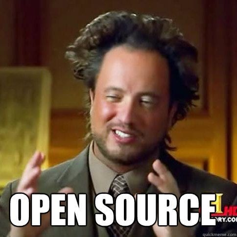

## CSCI040: ~Computing for the Web~ Introduction to Hacking
<!--
see: http://nifty.stanford.edu/2020/color-my-world/
-->

Important links:

1. [What Hackers get Paid](https://www.levels.fyi/comp.html?track=Data%20Scientist)

1. [Tech employers illegally collude to reduce salaries](https://en.wikipedia.org/wiki/High-Tech_Employee_Antitrust_Litigation)

## About the Instructor

|||
|-|-|
| Name | Mike Izbicki (call me Mike) |
| Email | mizbicki@cmc.edu |
| Office | Adams 216 |
| Office Hours | See [Issue #235](https://github.com/mikeizbicki/cmc-csci040/issues/235) |
| Zoom | See [Issue #237](https://github.com/mikeizbicki/cmc-csci040/issues/237) |
| Webpage | https://izbicki.me |
| Research | Machine Learning (see [izbicki.me/research.html](https://izbicki.me/research.html) for some past projects) |

Fun facts:
1. grew up in San Clemente (~1 hr south of Claremont)
1. 7 years in the navy
    1. nuclear submarine officer, personally converted >10g of uranium into pure energy
    1. worked at National Security Agency (NSA)
    1. left Navy as a [conscientious objector](https://www.nytimes.com/2011/02/23/nyregion/23objector.html)
1. phd/postdoc at UC Riverside
1. taught in [DPRK (i.e. North Korea)](https://pust.co)

## About the Course

**General Information:**

1. There are no prerequisites for this course.

1. This course fulfills the math general ed requirements for CMC students.

   But, most students find it much harder than taking MATH030 (Calculus I).
   If you haven't taken calculus, then you will likely have to put in about twice the amount of work on this class than you would to take calculus and get the same grade.

1. This course is similar to [CS4 at Pitzer](https://catalog.pitzer.edu/preview_course_nopop.php?catoid=28&coid=35324), [CS5 at Harvey Mudd](https://www.cs.hmc.edu/twiki/bin/view/CS5), and [CS51 at Pomona](http://www.cs.pomona.edu/~tzuyi/Classes/sp18/cs051p/).
    1. If you have already taken any of those courses,
       then you cannot take this course for credit.
       (Audit is okay.)
    1. If you are majoring in computer science,
       then you cannot take this course.
    1. This course is designed for CMC's 
        1. data science major,
        1. data science sequence,
        1. and computer science sequence.
    1. This course is more practical (and fun!) than the other CS courses.
        1. Lots of the cool applications in the Pomona/Mudd CS curriculum are "reserved" for their upper division class,
            but I've included them directly in this intro course.
        1. You will:
            1. Use LLMs (e.g. ChatGPT) to code.
                (And learn what they can/can't do.)
            1. Count the number of computers in North Korea connected to the internet.
            1. Build your own Twitter clone.
        1. This course is especially designed to connect computer science to non-STEM subjects like
            1. economics,
            1. government,
            1. literature, and
            1. history.

**Primary Learning Objectives:**

1. **Automate boring tasks** <-- this is a hacker's primary goal

    

1. Create static and dynamic web pages
1. Understand the basics of many programming languages:
    1. HTML
    1. CSS
    1. JavaScript
    1. Markdown
    1. Jinja
    1. SQL
    1. and **Python** <-- this is the main focus of the course

**Secondary Learning Objectives:**

1. Introduction to [hacker culture](http://www.catb.org/esr/faqs/hacker-howto.html) and [open source software](https://opensource.com/resources/what-open-source)

    

1. Understand basic:
    1. internet infrastructure
    1. common programming jargon
        1. ["front end" versus "back end" development](https://www.coursereport.com/blog/front-end-development-vs-back-end-development-where-to-start)
        1. [test driven development](https://streamhacker.com/2009/02/05/test-driven-development-in-python/)
    1. [accessible development](https://www.w3.org/standards/webdesign/accessibility)
        1. allow blind people to use webpages
        1. allow non-English speaking / non-Americans to use your software
    1. web security
        1. technical details (you will learn to commit fraud in this class... but obviously you shouldn't!)
        1. social implications
        1. government policy
        1. legal issues
    1. [search engine optimization](https://moz.com/beginners-guide-to-seo)
1. Use real-world programming tools
    1. Python libraries actually in use at [FAANG companies](https://www.investopedia.com/terms/f/faang-stocks.asp)
    1. GitHub (which is different than git, something we'll learn in the follow-on class CS46)
    1. LLMs

        

**Textbook:**

There is nothing to buy for this class.
All of our references are [free as in beer](https://en.wiktionary.org/wiki/free_as_in_beer).
Some of them are also [free as in speech](https://en.wiktionary.org/wiki/free_as_in_speech).

1. Shay Howe's [Learn to Code HTML & CSS](https://learn.shayhowe.com/html-css/).
1. Al Sweigart's [Automate the Boring Stuff with Python](https://automatetheboringstuff.com/).
1. Lots of other online resources as provided in the weekly schedule.

<!--
Hackers believe in the free exchange of information and often use the following websites to share textbooks and other knowledge:

1. https://b-ok.org
1. https://sci-hub.tw
1. https://thepiratebay.org

But most of the people who use these sites are [script kiddies](https://en.wikipedia.org/wiki/Script_kiddie).
-->

**Grades:**

| category                      | points/assignment         | *approximate* percentage |
| ----------------------------- | ------------------------- | ---- |
| labs (weekly)                 | $2^1$ - $2^2$             | 20%  |
| quizzes (weekly)              | $2^2$ - $2^3$             | 40%  |
| projects (every 2-3 weeks)    | $2^3$ - $2^6$             | 40%  |

This will be a low-stress but **very** challenging class.

1. The course is low-stress because you have full control over what your grade will be.
    1. **No midterm/final exam.**
       Weekly quizzes ensure you don't fall behind on material, and if you bomb a quiz it's not a big deal.

       1. You can retake 1 quiz in this class without any penalty if you don't like your grade for any reason.

          The first two quizzes can be retaken without any penalty.

       1. Quizzes will be open note, and you will have "unlimited" time.

       1. Final project due during finals week.

    1. Most weekly labs are automatically graded by Python.
       Keep working on them until you get 100%.

    1. Projects have TONs of extra credit opportunities.

        Lots of "choose your own adventure" style assignments where you get to decide which tasks you want to complete.

        In the past, some students have:
            1. ended the course with a 150%,
            1. choosen not to complete certain projects because they would get an A without completing them,
            1. go from a 70% to a 100% in the class with the final project.

1. The material is intrinsically *very* hard.
    1. That's why CS/DS majors get paid so much money... there's not many people willing to work hard enough to master these concepts.
    1. That's why we have an extra lab session each week (and so 50% more in-person instruction time).
        Also take advantage of office hours and the QCL.

        Historically:
        1. The average student needs to spend about 10 hours per week outside of class to get an A.
        1. About 50% of students choose to either:
            1. spend 15-20 hours per week and get an A-/A,
            1. or spend 10 hours per week and get a B/C.

1. The projects are designed to be fun, real-world projects:

    |     | Project                 | Difficulty    |
    | --- | ----------------------- | ------------- |
    | 0   | Building a Webpage      | Easy          |
    | 1   | Markdown compiler       | Hard          |
    | 2   | Data visualization      | Medium        |
    | 3   | Scraping ebay           | Medium        |
    | 4   | Reddit propaganda bot   | Hard          |
    | 5   | Twitter clone           | Hard          |

    This class has fewer projects than in CS4/CS5/CS51.
    (Those courses have 1 project per week.)

    Our projects more fun/interesting.
    (But maybe a bit harder.)

    Our projects emphasize techniques that LLMs cannot do by themselves.
    (And I will teach you how to use LLMs productively to improve your work.)

    Our projects are "light" versions of projects from [CSCI046 data structures](https://github.com/mikeizbicki/cmc-csci046) and [CSCI143 big data](https://github.com/mikeizbicki/cmc-csci143).
    (Completing these projects gets you a head start in those future classes.)

Your final grade will be computed according to the following table,
with one caveat.

| If your grade satisfies          | then you earn |
| -------------------------------- | ------------- |
| 95 &le; grade                    | A             |
| 90 &le; grade < 95               | A-            |
| 87 &le; grade < 90               | B+            |
| 83 &le; grade < 87               | B             |
| 80 &le; grade < 83               | B-            |
| 77 &le; grade < 80               | C+            |
| 73 &le; grade < 77               | C             |
| 70 &le; grade < 73               | C-            |
| 67 &le; grade < 70               | D+            |
| 63 &le; grade < 67               | D             |
| 60 &le; grade < 63               | D-            |
| 60 > grade                       | F             |

*CAVEAT:*
In order to earn an A/A- in the class, you must also complete one of the following tasks.

1. Watch the following shows/movies about [cracking](http://www.catb.org/~esr/jargon/html/C/cracking.html) and [hacking](http://www.catb.org/~esr/jargon/html/H/hacker.html):

    1. Season 1 of Mr. Robot (available on [Amazon Prime](https://www.amazon.com/gp/video/detail/B00YBX664Q)).
       This is the most accurate portrayal of cracking in any movie, see for example [this article](https://www.pri.org/stories/how-realistic-are-hacks-mr-robot) and [this article](https://www.wired.com/2016/07/real-hackers-behind-mr-robot-get-right/).

    1. War Games (available on [Amazon Prime](https://www.amazon.com/Wargames-Matthew-Broderick/dp/B083FY4CDG/)).
       This is a classic hacker movie and was quite realistic for what hacking looked like when the movie was released (1983).

    1. CitizenFour (available for free from the [Internet Archive](https://archive.org/details/Citizen.Four2014)).
       This is a documentary about Edward Snowden and the hacking that the NSA does.
       There's also a live-action movie called [Snowden](https://www.amazon.com/Snowden-Joseph-Gordon-Levitt/dp/B01LWYVHKV) that you could also choose to watch.

    1. Zero Days - Security Leaks for Sale (available for free on [youtube](https://www.youtube.com/watch?v=4BTTiWkdT8Q))
        This documentary explores the [grey hat](http://www.catb.org/~esr/jargon/html/B/black-hat.html) world of hackers who develop software to break into computers and sell that software to questionable people... and it's all legal.

1. Read [Harry Potter and the Methods of Rationality](https://hpmor.com).
   This is a fanfic written by [Eliezer Yudkowsky](https://en.wikipedia.org/wiki/Eliezer_Yudkowsky),
   who is a famous [AI safety](https://futureoflife.org/ai-safety-research/) researcher.
   The premise is that Harry Potter's parents were both wizards and scientists,
   and the story introduces a lot of concepts important for AI safety and the philosophy of data science.

   > **NOTE:**
   > This is a LONG reading (roughly the equivalent of 2-3 books).
   > Watching the shows/movies is the most efficient option time-wise.

See [Issue #260](https://github.com/mikeizbicki/cmc-csci040/issues/260) for instructions on how to get credit for completing these readings / viewings.

**Late Work Policy:**

You lose `2**(i-1)` points on every assignment,
where `i` is the number of days late.

Do not expect partial credit for incomplete assignments.
It is much better to submit a correct assignment late than an incorrect one on time.

If you visit the QCL for help with any assignment,
you get an automatic 2 day extension.

**Collaboration Policy:**

You are encouraged to discuss all labs and projects with other students,
subject to the following constraints:

1. You must be the person typing in all code for your assignments.
1. If you ask someone for help: you may show your code to the other person, but you may not view their code.

You may use any online resources you like as references (including LLMs!) without restriction.

Basically, I'm trusting you all to be adults.
You are ultimately responsible for ensuring you learn the material!
So do what will help you learn best.

> **WARNING:**
> All material in this class is cumulative.
> If you work "too closely" with another student on an assignment,
> you won't understand how to complete subsequent assignments,
> and you will quickly fall behind.
> You should view collaboration as a way to improve your understanding,
> not as a way to do less work.

<!--Reading:

https://www.reddit.com/r/cscareerquestions/top/?sort=top&t=all

Tim Berner's Lee https://www.w3.org/People/Berners-Lee/

How the internet works: https://thesquareplanet.com/blog/how-the-internet-works/

Web architecture 101: https://engineering.videoblocks.com/web-architecture-101-a3224e126947

OPSEC: https://www.telegraph.co.uk/news/worldnews/northamerica/usa/11229241/FBIs-most-wanted-cyber-criminal-caught-out-by-pet-cat-password.html

reddit jsonp: https://www.reddit.com/r/programming/comments/cxh3a/we_just_added_jsonp_to_reddits_json_api/

jsfiddle

|-->

<!--
Python libraries:
* newspaper3k
* wikipedia
* googletrans
* twilio (SMS) + weather-api
* geopy
* langid.py
* https://github.com/vinta/awesome-python
Python libraries: newspaper3k, wikipedia, geopy, langid.py, googletrans | |
-->

<!--
Recursion
https://realpython.com/python-thinking-recursively/

Install Python: https://learnpythonthehardway.org/python3/ex0.html

Reddit bot: https://www.pythonforengineers.com/build-a-reddit-bot-part-1/

Twitter bot: https://realpython.com/twitter-bot-python-tweepy/

Traceback: https://realpython.com/python-traceback/

Classes: https://realpython.com/inheritance-composition-python/

Unicode Python3: https://realpython.com/python-encodings-guide/

Python tips: https://realpython.com/python-coding-interview-tips

Sorting: https://realpython.com/python-sort/

Command line interface: https://realpython.com/command-line-interfaces-python-argparse/

Basic IO: https://realpython.com/python-input-output/

PEP 20: https://www.python.org/dev/peps/pep-0020/
PEP 8: https://www.python.org/dev/peps/pep-0008/#a-foolish-consistency-is-the-hobgoblin-of-little-minds

Use `doctest` for automatic grading: https://docs.python.org/3/library/doctest.html

Automate the boring stuff https://automatetheboringstuff.com/chapter2/

Scraping:
https://www.scrapehero.com/how-to-scrape-competitor-prices-from-ebay-com-using-python-and-lxml/
https://www.scrapehero.com/xpaths-and-their-relevance-in-web-scraping/
https://lxml.de/3.2/elementsoup.html

NSA:
https://www.reuters.com/article/us-usa-surveillance-watchdog-idUSBRE98Q14G20130927

Border agents checking social media:
https://news.ycombinator.com/item?id=20848359

South Africa surveillance:
https://news.ycombinator.com/item?id=20861729
https://www.iafrikan.com/2019/09/02/south-africa-mass-surveillance-spying-undersea-fiber-cables/
-->

## Accommodations for Disabilities

I've tried to design the course to be as accessible as possible for people with disabilities.
(We'll talk a bit about how to design accessible software in class too!)
If you need any further accommodations, please ask.

I want you to succeed and I'll make every effort to ensure that you can.

<!--

make labs due during the lab session; -1 point penalty for submitting late

introduce pythontutor before doing python in vscode?

Trick questions:
 1. += vs =+
 1. while n:
        n //= 10
 1. for i in range(-5, 5):
        if i:
            do something

Functions:
1. Create functions with default valued arguments
1. Call functions with named arguments (in different orders)/variable number of arguments
1. Call functions from within functions, actually using the returned result (return vs print)

students don't understand functions and the difference of return/print

for loop flags; the reddit assignment looping to see if a comment has a reply needs a boolean flag; we should visit this patter earlier in the class

difference between pass vs continue

blah(
    username=xxx
)
print(username) # generates an error

call a function without parentheses:
def foo():
    print('hello')
    # print vs return
foo

Exceptions:
1. Add ValueError to errors discussion
1. cover when the error happens midway through the try
1. when the error happens in the except clause
1. cover try/except within try/except

SQL:
1. More step-by-step lab instructions
1. Do lab with just SQL+Python before involving flask

================================================================================

More patterns:

students struggle with nested lists/dictionaries; do more examples early on

dictionary pattern where we have a list of items,
and we use dictionary keys as the items and values as the counts

dictionary/json pprint

wait for dictionaries with JSON?  students have a LOT of trouble with dictionary indexing

list like objects especially with praw not giving lists back

str(comment.author)

for comment in comments:
    do comment
comment

for word in string is wrong

if list == 0 instead of len(list)==0

for comment.reply in comments.reply

random.choice([])

students don't understand the ? syntax in sql do quiz wth '?' vs ? and other insert syntax variations with python; last quiz was just sql, which wasn't enough; need for con.commit() and cur.fetchall()

insert into users (username,password) values (username=?,password=?);

students forget that you need parenthesis to call a function
con.commit
vs
con.commit()

request.form.get('message')
select message from messages;
message  <<-- students don't understand why you can't refer to just message in python

-->
