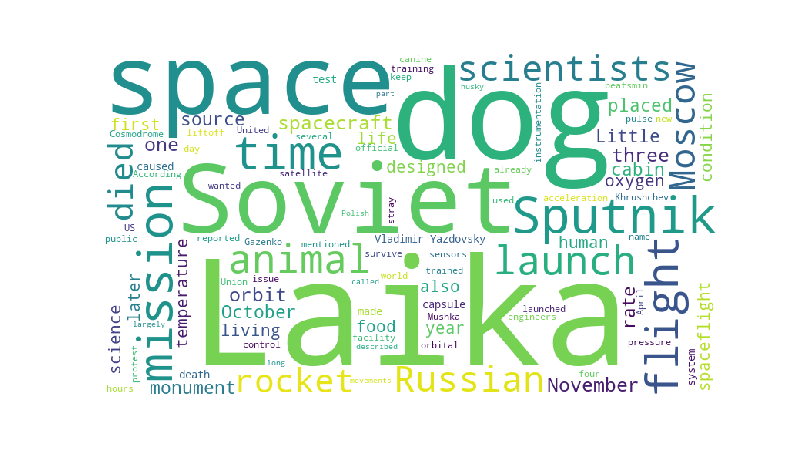

# Homework 2: Webpage Analyzer

**Due:** Thursday, ~~Oct 17~~ Oct 24 at the start of class

**Description:** 
You will write a program that downloads an HTML webpage,
extracts the text from the webpage,
and then performs a simple statistical analysis to find the most common words on the webpage.
For example, if we download the webpage https://en.wikipedia.org/wiki/Laika,
then an example output is

```
title: Laika
--------------------
laika      : 33
space      : 21
soviet     : 19
dogs       : 16
sputnik    : 12
dog        : 12
mission    : 12
time       : 12
launch     : 10
laikas     : 10
flight     : 10
scientists : 8
moscow     : 8
russian    : 8
died       : 7
animals    : 7
rocket     : 6
one        : 6
november   : 6
spacecraft : 6
```

You also have the option of getting extra credit by using python to generate word clouds from the webpage.
The word cloud for the webpage above is



## Instructions

Complete the following tasks:

1. Use the `pip3` command to install the `requests` and `bs4` libraries.

1. Implement all the functions in the `helper_functions.py` file.

1. Run the `helper_functions.py` file to run the doctests and ensure your implementations of these functions are correct.

1. Run the `webpage_analyzer.py` file to discover the most commonly used words in a webpage.  You do not have to modify this file at all.  If you have implemented all of the functions in `helper_functions.py` correctly, then running `webpage_analyzer.py` should give you similar output to the example shown above.

## Grading Rubric

1. Each function in the `helper_functions.py` file is worth 10 points each.  There are 10 functions, for a total of 100 points.

1. There are two opportunities for extra credit:

    1. You can earn 5 points of extra credit for an improved version of the `print_dictionary` function (details in the function's docstring).

    1. You can earn 10 points of extra credit for generating word cloud images using python's `wordcloud` library.  Instructions are in the `extra_credit.py` file.

## Submission

You will submit hard copies of all your python files and their outputs in class.  
In particular, create a packet with the following items:

1. A title page with your name and self-evaluated score (may be handwritten).

1. The output of running `webpage_analyzer.py` (this is the main output of the program)

1. The output of running `helper_functions.py` (this is the output of all the doctests)

1. The contents of the `webpage_analyzer.py` file

1. The contents of the `helper_functions.py` file

If you completed the wordcloud extra credit, then your packet should also include:

1. The `wordcloud.png` file generated when running `webpage_analyzer.py`

1. The contents of the `extra_credit.py` file

Your submission must be stapled or paperclipped together,
and the items must be in the order specified above.
